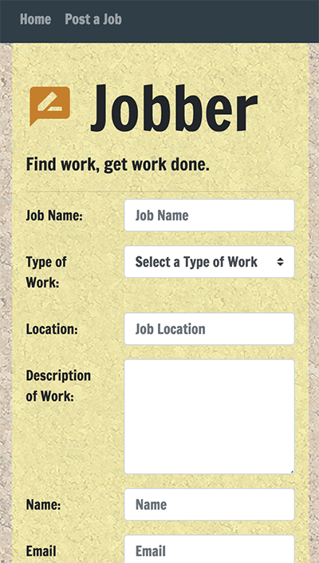
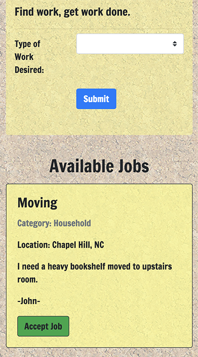

# Jobber

Jobber is a bulletin board-like application that allows users to either: post work requests, or find and accept work requests that other community members have posted. 

It is a full-stack application and follows MVC architecture. Express.js is used for server routing and a MySQL database stores user input in three different tables.

## View the Project
You can view the project, hosted by Heroku, here: [https://shrouded-garden-83490.herokuapp.com/](https://shrouded-garden-83490.herokuapp.com/)

## Instructions for Use
The homepage is where you find jobs that have been posted, and are in varying degrees of completeness. The "Post a Job" page is where users who want to post a request for work can do so. The email and password that you enter here when posting a job are required later when you mark the job complete. 

After posting a job, you can go to the homepage to see that job in the "Available Jobs" category. 
* When with the skills to undertake that job wants it, the simply click "Accept Job" and enter their name email and skills. 
* The page is also filterable by job *Category*, by using the dropdown at the top. 
* Jobs "In Progress" have options for users to click and learn about the ratings of workers who have taken on the jobs, so that their performance can be evaulated by the community over time.
* This is also where job posters can mark jobs complete once finished.

When a poster chooses to "Mark Complete", they are prompted to enter their email and password -- to verify that they are the one who posted the job -- and they are also promted to leave a 1-5 rating on the quality of the work done. This rating is then shown under "Completed Jobs", and more aggregated information on workers can be viewed here by clicking on the worker's name. 

## Technologies Used
* Javascript / HTML / CSS
* Bootstrap
* Node.js
* Express.js
* Chart.js
* Moment.js
* Canvas
* MySQL / Sequelize

## Contributors
Berk Biryol
Henry Kirse
Ned Nimocks

## Screenshots

### Top of Home:

### Bottom of Home:

### Post Job page:

### Chart Modal:

### Mobile Responsive Post Page:

### Mobile Responsive Home Page:

### Mobile Responsive Chart Modal:
